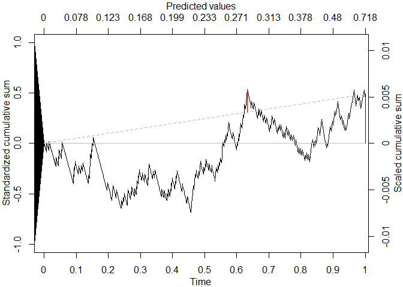

<!-- README.md is generated from README.Rmd. Please edit that file -->

# cumulcalib

<!-- badges: start -->

[](https://github.com/msadatsafavi/cumulcalib/actions/workflows/R-CMD-check.yaml)
<!-- badges: end -->

The goal of cumulcalib is to enable the use of the assessment of
prediction model calibration using the cumulative calibration
methodology. For more information, please refer to the original
publication (arxiv version: <https://arxiv.org/abs/2307.09713>). The
package also comes with a tutorial, which you can view after installing
the package as

``` r
vignette("tutorial", package="cumulcalib")
```

## Installation

You can install the development version of cumulcalib from
[GitHub](https://github.com/) with:

``` r
# install.packages("remotes") #this package is necessary to connect to github
remotes::install_github("resplab/cumulcalib")
```

## Example

``` r
library(cumulcalib)

set.seed(1)
p <- rbeta(1000, 1,5)
y <- rbinom(1000,1,p)

res <- cumulcalib(y, p)

summary(res)
#> C_n (mean calibration error): 0.00532270104567871
#> C* (maximum absolute cumulative calibration error): 0.00740996981029672
#> Method: Two-part Brownian Bridge (BB)
#> S_n (Z score for mean calibration error) 0.489295496431201
#> B* (test statistic for maximum absolute bridged calibration error): 0.904915434767163
#> Component-wise p-values: mean calibration=0.624632509005787 | Distance (bridged)=0.385979705481866
#> Combined p-value (Fisher's method): 0.584068794836004
#> Location of maximum drift: 812  | time value: 0.632911942275094  | predictor value: 0.28191196504736
plot(res, draw_sig=F)
```


